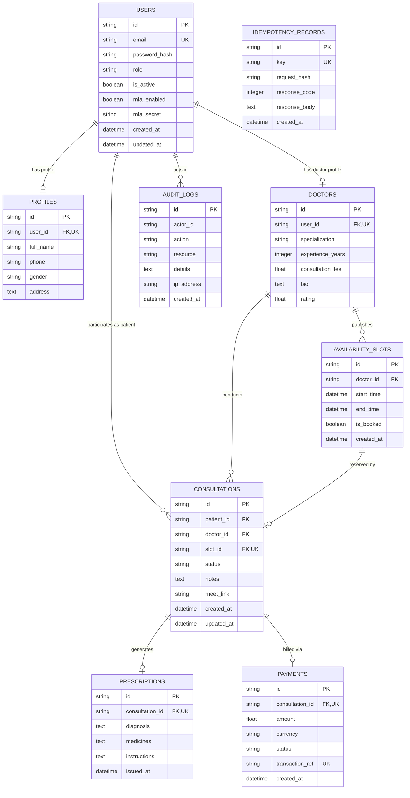

# Entity Relationship (ER) Diagram

The diagram below represents the relational schema implemented for Amrutam's Telemedicine System.

```mermaid
erDiagram
    USERS ||--o| PROFILES : "has profile"
    USERS ||--o| DOCTORS : "has doctor profile"
    USERS ||--o{ CONSULTATIONS : "participates as patient"
    DOCTORS ||--o{ AVAILABILITY_SLOTS : "publishes"
    DOCTORS ||--o{ CONSULTATIONS : "conducts"
    AVAILABILITY_SLOTS ||--o| CONSULTATIONS : "reserved by"
    CONSULTATIONS ||--o| PRESCRIPTIONS : "generates"
    CONSULTATIONS ||--o| PAYMENTS : "billed via"
    USERS ||--o{ AUDIT_LOGS : "acts in"

    USERS {
        string id PK
        string email UK
        string password_hash
        string role
        boolean is_active
        boolean mfa_enabled
        string mfa_secret
        datetime created_at
        datetime updated_at
    }

    PROFILES {
        string id PK
        string user_id FK, UK
        string full_name
        string phone
        string gender
        text address
    }

    DOCTORS {
        string id PK
        string user_id FK, UK
        string specialization
        integer experience_years
        float consultation_fee
        text bio
        float rating
    }

    AVAILABILITY_SLOTS {
        string id PK
        string doctor_id FK
        datetime start_time
        datetime end_time
        boolean is_booked
        datetime created_at
    }

    CONSULTATIONS {
        string id PK
        string patient_id FK
        string doctor_id FK
        string slot_id FK, UK
        string status
        text notes
        string meet_link
        datetime created_at
        datetime updated_at
    }

    PRESCRIPTIONS {
        string id PK
        string consultation_id FK, UK
        text diagnosis
        text medicines
        text instructions
        datetime issued_at
    }

    PAYMENTS {
        string id PK
        string consultation_id FK, UK
        float amount
        string currency
        string status
        string transaction_ref UK
        datetime created_at
    }

    AUDIT_LOGS {
        string id PK
        string actor_id
        string action
        string resource
        text details
        string ip_address
        datetime created_at
    }

    IDEMPOTENCY_RECORDS {
        string id PK
        string key UK
        string request_hash
        integer response_code
        text response_body
        datetime created_at
    }
```
